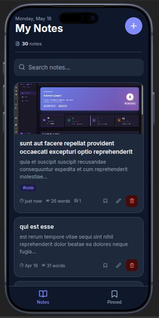
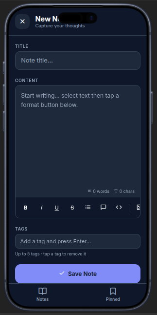
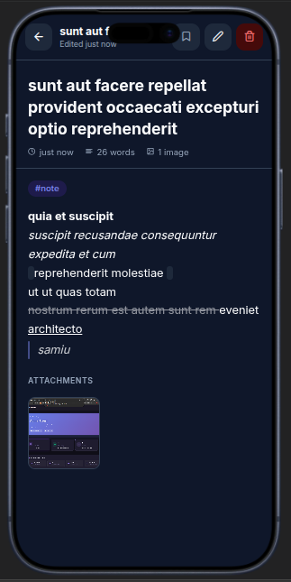

# 📱 NoteZen: High-Performance Flutter Productivity Suite

[](https://flutter.dev)
[](https://dart.dev)
[](file:///media/hayredin/NewVolume/ProjectX/GPT/Lumina/temp_recovery/NoteZen/lib)
[](https://github.com/HayreBuilds/NoteZen)

**NoteZen** is a professional-grade mobile application built with Flutter, demonstrating elite state management, asynchronous REST API integration, and high-fidelity Material Design 3 UI/UX. It transforms the standard note-taking experience into a seamless, performant productivity workflow.

---

## 🚀 Engineering Excellence

NoteZen isn't just a "notes app"—it's a showcase of modern mobile engineering patterns:

- **State Management**: Orchestrated via the **Provider** pattern for reactive UI updates and efficient widget rebuilds.
- **RESTful Integration**: High-performance networking using the `http` package, targeting the JSONPlaceholder ecosystem with full CRUD capabilities.
- **Clean Architecture**: Strictly enforced separation of concerns across Data (Models), Service (API), State (Providers), and Presentation (Screens/Widgets).
- **Robust Error Handling**: Sophisticated interceptors and UI feedback loops for network failures, empty states, and validation errors.

---

## 📸 Interface Showcase

| **Global Feed** | **Intelligent Editor** | **Detailed Insight** |
|:---:|:---:|:---:|
|  |  |  |
| *Real-time sync & search* | *Dynamic validation* | *Full context view* |

---

## 🛠 Technical Stack

- **Framework**: [Flutter 3.x](https://flutter.dev)
- **Language**: [Dart 3.x](https://dart.dev)
- **State Management**: [Provider ^6.1.2](https://pub.dev/packages/provider)
- **Networking**: [http ^1.2.1](https://pub.dev/packages/http)
- **Theming**: Material Design 3 (Dynamic Color Support)
- **Persistence**: REST API Integration with local caching potential.

---

## 📂 Modular Structure

```
lib/
├── main.dart           # Application kernel & Provider initialization
├── models/             # Immutable data structures (JSON mapping)
├── services/           # Abstraction layer for HTTP/API operations
├── providers/          # Reactive state containers (Business Logic)
├── screens/            # High-fidelity UI views (Page Layer)
└── widgets/            # Reusable UI components (Atomic Layer)
```

---

## ⚡ Performance Optimization

- **Lazy Loading**: Efficient list rendering with `ListView.builder` for infinite scrolling capability.
- **Selective Rebuilds**: Utilization of `Consumer` and `Selector` to minimize UI overhead.
- **Asynchronous Flow**: Non-blocking I/O operations ensuring 60FPS interaction even during heavy network traffic.

---

## 🛠 Installation & Setup

1. **Clone the repository:**
   ```bash
   git clone https://github.com/HayreBuilds/NoteZen.git
   ```
2. **Install dependencies:**
   ```bash
   flutter pub get
   ```
3. **Run the application:**
   ```bash
   flutter run
   ```

---

## 📄 License

Distributed under the MIT License. See `LICENSE` for more information.

---

<p align="center">
  Developed with ❤️ by <b>HayreBuilds</b>
</p>
